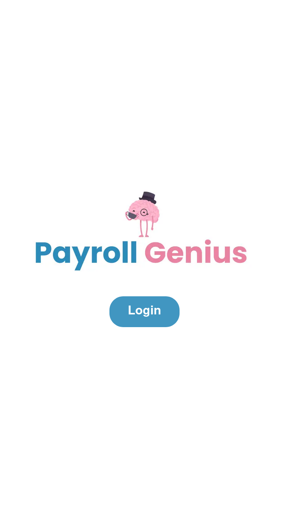
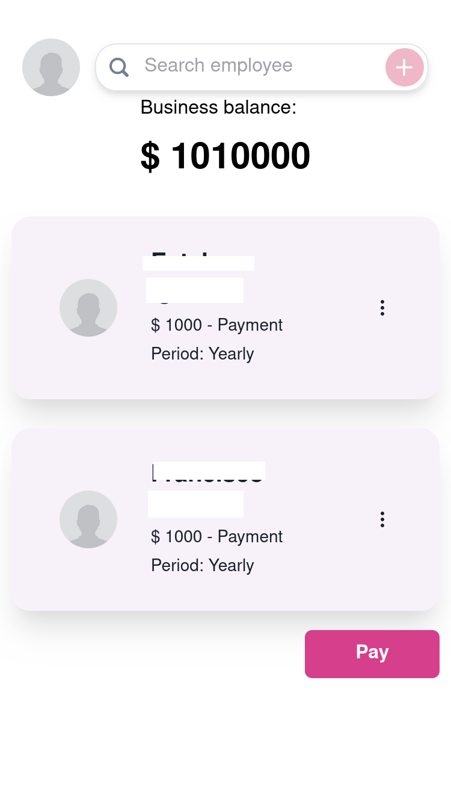
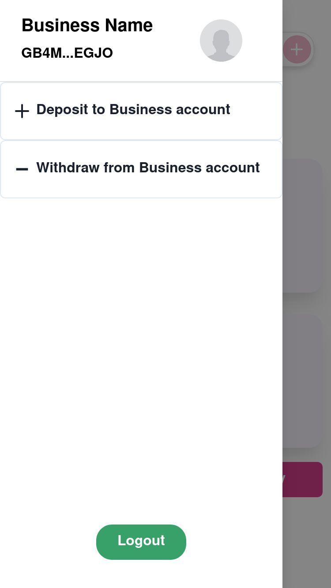
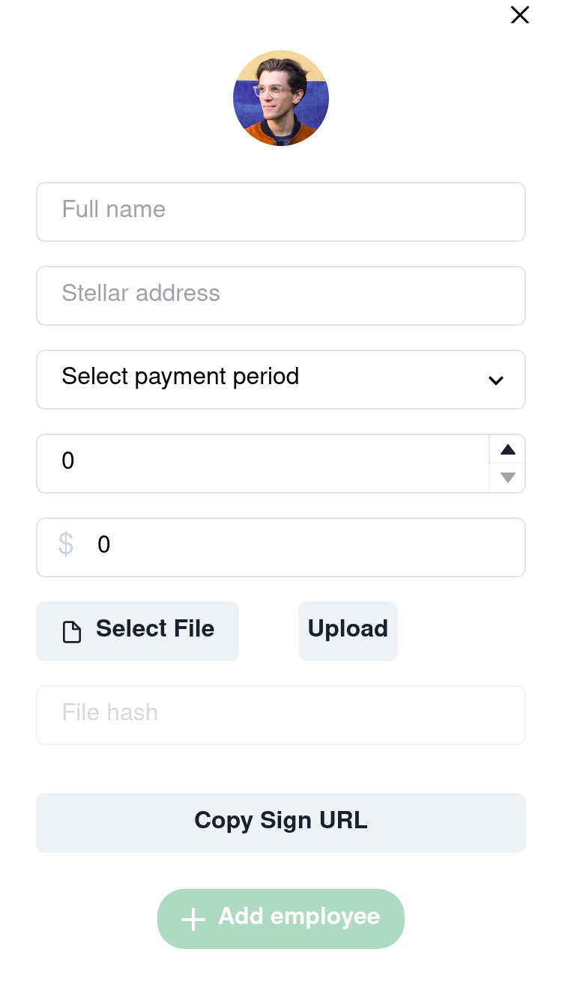
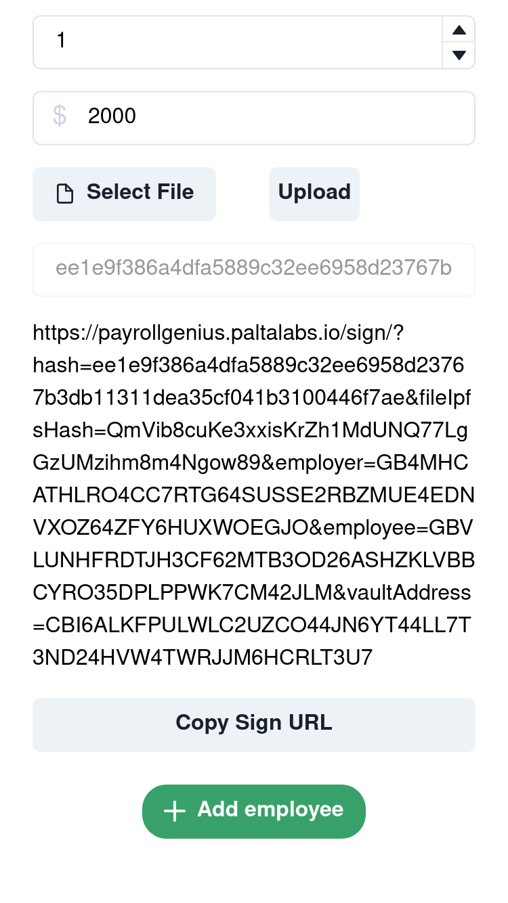
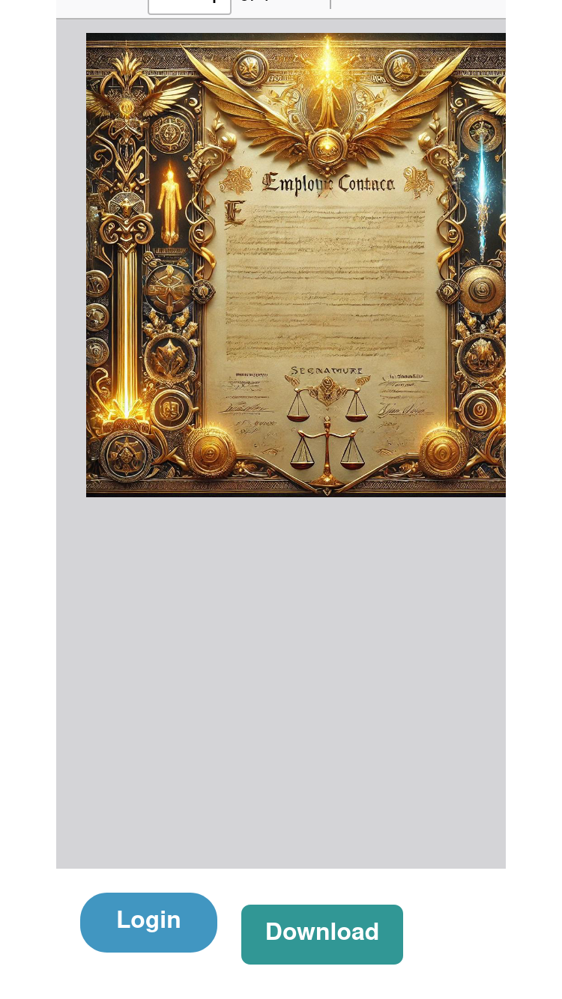

# Welcome to Payroll Genius 🧠!


Payroll Genius is a decentralized app (dApp) that streamlines employment contract signatures and salary payments, enabling SMEs to earn yield on their funds while providing employees access to global loans through DeFi. Designed to simplify payroll processes, it leverages Stellar blockchain's DeFi solutions for seamless integration.

-> [DEMO](https://payrollgenius.paltalabs.io/) To play around, you need to mint test tokens from [Soroswap.Finance](https://app.soroswap.finance/balance)

# 👀 [TECHNICAL WALKAROUND VIDEO!!!!!](https://youtu.be/H84pWAEkSTY)
[](https://youtu.be/H84pWAEkSTY)


## Pre requisites
- [ ] Docker (tested with Docker version 27.1.2)
- [ ] Browser with Freighter Wallet
- [ ] Get Accounts on Stellar Laboratory or Freighter!
- [ ] Have a pinata account
- [ ] Mint test tokens on [Soroswap.Finance](https://app.soroswap.finance/balance)

## Build, Compile, Deploy and Test your self.
1. Setup secrets
    ```bash
    cp .env.example .env
    ```
    fill the variables:
   ```
   JWT=
    PINATA_API_SECRET=
    PINATA_API_KEY=
    ```
2. Get the required Docker containers up!
This helps us be sure that we all run the same software!

    ```bash
    bash run.sh
    ```

3. Test and Compile the PayrollVault Smart Contract
    ```bash
    cd /workspace/contracts
    cp .env.example .env # for private keys
    make build
    make test
    ```
3. Fill the /contracts/.env file with the deployers private key

4. Deploy the PayrollVault Smart Contract 
    ```bash
    cd /workspace/contracts
    yarn
    yarn deploy testnet # can also be mainnet if you have some XLM for gas!
    ```

5. Run the ReactJS frontend
    ```bash
    cd /workshop/
    yarn
    yarn dev
    ```
This will start the development server. The dapp will be available on `localhost:3000`. 


# Full Description of the Project

Payroll Genius solves multiple challenges with a single solution.

First, it offers an easy-to-use tool for employers and employees to digitally sign traditional (PDF) employment contracts, with the agreements stored in a decentralized and verifiable way. The employment process includes setting the salary, payment frequency (weekly, monthly, annually), and the number of guaranteed pay periods in case the employee is terminated. Businesses are only allowed to employ workers if they have sufficient funds to cover at least the guaranteed pay periods.

Next, businesses can load their Payroll Vault with incoming revenue from new sales. These funds are used to pay employee salaries. When not actively distributing payments, the funds generate yield by being invested in the preferred DeFi protocols, such as lending through Blend.Capital and reinvesting BLND token rewards via the DeFindex protocol.

At the end of each pay period (weekly, monthly, or yearly, depending on the contract), businesses can process salary payments for all employees in a single transaction, significantly reducing bureaucratic complexity.

During the entire employment period, employees have the certainty that they will be paid according to the terms of their signed contract. This provides them with the ability to secure loans backed by their future salary payments. Lenders can globally access to this market, earning yield on their funds.

We believe this design is highly compliant, as businesses are solely involved in receiving payments, investing funds, and paying salaries. The lending and accounting processes remain straightforward for lenders.


# Technical explanation

Our project utilizes a combination of Stellar's Soroban smart contracts, ReactJS, IPFS, @soroban-react NPM library, MD5 hashing, and SEP24/SEP6 for on/off ramps. Below is a breakdown:

## Employment Contract Signing

We use ReactJS with the @soroban-react to handle message signing with Stellar wallets like Freighter. The employment contract signing process involves:

- ReactJS Frontend: Employers and employees interaction
- Soroban Smart Contracts: Our protocol consists on one main PayrollVault Smart Contract that registers the employer-employee relationship and binds the employment agreement upon acceptance, including an MD5 hash of the PDF contract.
- IPFS (Pinata): The PDF contract is uploaded to IPFS for decentralized storage, but access to the link remains private between the employer and employee in a link that will be shared by the employer to the employee.
- Hashing & Verification: The MD5 hash ensures the integrity of the contract. The employer shares a private link with the document to the employee, who can verify the hash and sign the contract using their Stellar wallet. The private link includes the md5 hash + the ipfs URL.

## DeFi Yields for Business Funds

We use Soroban smart contracts to manage the business’s payroll funds:

- **DeFi Integration:** When a business deposits new funds (from sales or other income), Soroban smart contracts allocate the funds to yield-generating DeFi strategies. Upon salary payments, the funds are withdrawn from these DeFi strategies to pay employees.
- **Automatic Transactions:** Each time a business adds funds or makes a payroll payment, a sub-contract transaction is executed through Soroban, automating the process.

## Payroll Payments

Payroll payments are processed through:

- **ReactJS Frontend:** We use the `@soroban-react` NPM library for managing Stellar wallet interactions.
- **On/Off-Ramps (SEP-24/SEP-6):** Although not yet implemented, we plan to use Stellar's SEPs for fiat on-ramps (POS income to the business vault) and off-ramps (to transfer salaries from employer’s vault to bank accounts). However, this cannot be done right now because the standar that connects Smart Contracts with Anchors is under discussion. 

## Lending System

The lending process is entirely powered by Soroban smart contracts, allowing employees to access loans backed by their future salary payments. Lenders can globally access this market, earning yield on their investments.

# Roadmap
## Phase 1: Foundation Development

### Smart Contract Infrastructure

- Develop and secure the core Payroll Vault smart contracts on Soroban.
- Implement decentralized storage of employment contracts using IPFS.
- Integrate MD5 hashing for contract integrity verification.

### User Interface

- UX research for frontend.

### Payroll Management

- Enable employers to set salary parameters, payment frequency, and guaranteed pay periods.

- Automate bulk payroll processing through Soroban smart contracts.

## Phase 2: DeFi Integration

### Yield Generation

- Integrate DeFi protocols like DeFindex for idle payroll funds.

- Automate investment

### Financial Dashboard

- Develop BI and analytics tools for employers to monitor investments and payroll expenses.

### Compliance

- Implement safeguards to ensure businesses have sufficient funds for guaranteed pay periods.

- Develop compliance modules adhering to financial regulations.

## Phase 3: Employee Empowerment and Lending

### Employee Loans

- Implement a lending system allowing employees to secure loans against future salary payments.

- Create a global marketplace for lenders to invest in employee-backed loans.

### Risk Management

- Develop risk assessment tools leveraging employment contract data for lenders.

### Employee Tools

- Provide employees with dashboards to manage loan applications and repayments.

## Phase 4: Ecosystem Integration

### Onboarding Strategy

- Target and onboard startups and companies using USDC and strong stablecoins.

- Expand to countries with high stablecoin adoption.

### Third-Party Integrations

- Connect with accounting tools like Kwickbit for seamless financial reporting.

- Integrate with HR tools to synchronize employee data.

- SEP Implementation: Prepare for future on/off-ramp integration once standards are finalized.

## Phase 5: AI and Automation Enhancements

### AI-Powered Contract Conversion

- Utilize AI to convert traditional PDF contracts into smart contracts between peers.

## Phase 6: Monetization

### Subscription Models

- Introduce a fee system and subscription tiers offering premium features.

### Multi-Currency Support

- Expand support to multiple stablecoins and fiat currencies.

## Phase 7: Global Expansion

- Cross-Border Payroll

- Enable cross-border payroll capabilities to simplify international payments.
- Compliance with cross-border regulation.

# Screenshots







